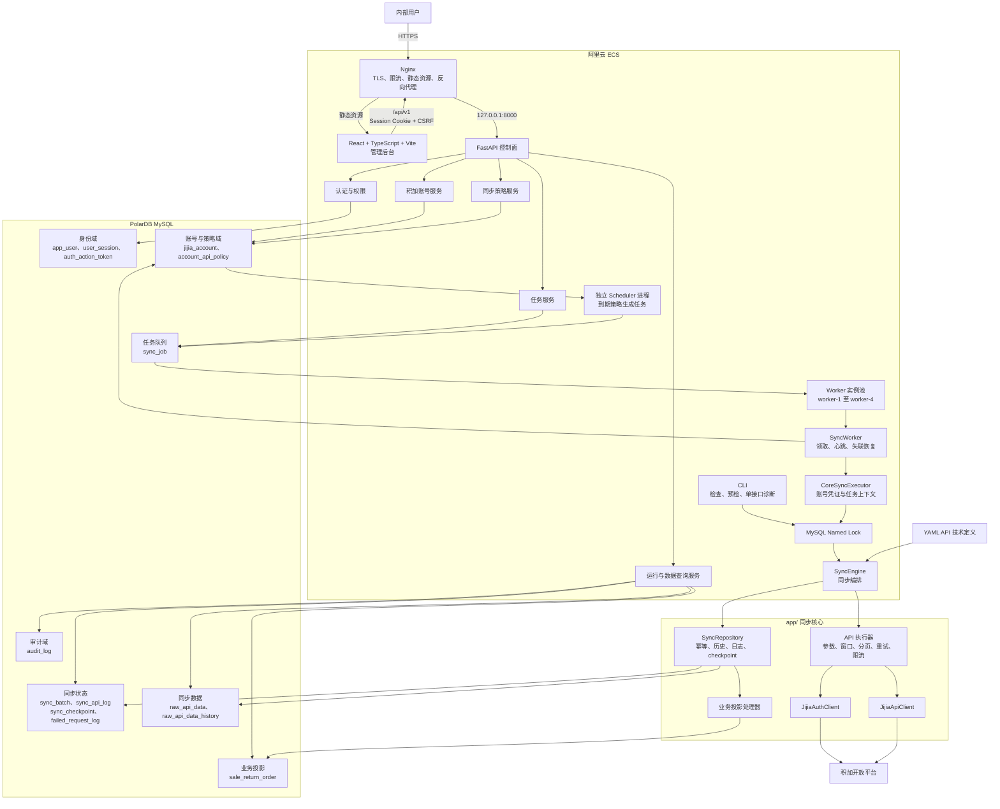

# 积加数据同步内部 Web 管理平台架构方案

## 1. 文档目标

本文档用于明确项目从“CLI 数据同步工具”演进为“内部 Web 管理平台”的目标架构、职责边界、实施顺序、验收标准和回滚方式。

项目只有两个宏观阶段：

1. **积加 API 同步工具（历史基础）**：以 CLI 和 cron 为入口，沉淀鉴权、请求、分页、重试、落库和 checkpoint 能力。它不再是最终产品，也不再承担平台完成后的生产日常同步。
2. **SEEKWAY 数据接入中心（当前且唯一目标）**：积加作为首个数据源连接器，以 Web、Scheduler、数据库任务队列和 Worker 为唯一生产业务入口。第一阶段代码只作为平台内部积加同步内核及受控迁移、检查能力存在。

本文后续 M1～M4 和“平台收口步骤”均属于第二阶段内部工作，不得与上述两个宏观阶段混用。

本方案遵循以下原则：

- 保留现有 `app/` 同步核心，不将同步逻辑迁入 Web 目录。
- 保留 FastAPI、React、TypeScript、Vite 和 PolarDB MySQL 技术栈。
- 保持 ECS、Nginx、systemd 原生部署，不引入 Docker。
- 当前使用数据库任务队列和四个独立 Worker 实例，不引入 Redis、Celery 或 Kafka。
- 优先解决调度归属、配置事实来源和同步核心职责过重的问题。
- 采用渐进式改造，不进行一次性重写。

## 2. 产品定位

本产品定位为公司内部使用的 SEEKWAY Data Hub（SEEKWAY 数据接入中心），服务于单一组织；当前先管理多个积加账号，后续只在出现第二个真实数据源时提炼通用连接器边界。

平台主要目标：

1. 管理内部用户和角色权限。
2. 安全管理多个积加账号及其加密凭证。
3. 为不同账号配置 API 同步策略和运行周期。
4. 创建、取消、重试和追踪同步任务。
5. 查看同步批次、接口日志、失败记录和 checkpoint。
6. 查询原始 JSON 最新快照、变化历史和业务投影。
7. 通过审计日志追踪敏感操作。

第一版不包含：

- 外部客户租户体系。
- 组织、计费、套餐和配额。
- 用户自定义 SQL。
- 通用报表或可视化编排引擎。
- Redis、Celery、Kafka 等额外基础设施。

## 3. 当前架构判断

当前项目已经具备内部 Web 管理平台的基础骨架：

- `frontend/` 提供 React 管理后台。
- `backend/` 提供 FastAPI 控制面、身份认证、账号管理、任务管理和数据查询。
- `backend/app/worker.py` 提供可多实例运行的独立 Worker 进程。
- `app/` 提供积加认证、API 请求、分页、重试、幂等写入和同步状态维护。
- PolarDB MySQL 同时承担业务数据存储和数据库任务队列。
- Nginx 负责 TLS、静态资源、登录限流和 API 反向代理。

当前架构总体合理，主要问题不是技术选型，而是系统仍处于从第一阶段退出生产运行、由第二阶段完全接管的临时割接期：

1. Legacy cron/CLI 和 Web Scheduler 都可能发起同步任务。
2. YAML、API catalog、`api_config` 和 `account_api_policy` 的职责需要进一步明确。
3. `SyncEngine` 同时承担编排、参数、分页、重试、存储、日志和 checkpoint，职责偏重。
4. `jijia_account_id=0` 仍用于兼容 Legacy 数据，属于过渡性数据边界。

## 4. 目标架构



## 5. 核心职责边界

### 5.1 React 管理后台

React 只负责用户交互和状态展示，不包含同步业务规则。

主要页面：

- 工作台。
- 用户与邀请。
- 积加账号。
- 账号 API 策略。
- 同步任务。
- 同步运行记录。
- 原始数据及历史版本。
- 业务查询投影。
- 审计日志。

### 5.2 FastAPI 控制面

FastAPI 负责：

- Session、CSRF 和角色权限。
- 账号与加密凭证管理。
- 同步策略管理。
- 手工任务创建、取消和重试。
- 同步状态、原始数据和业务投影查询。
- 审计日志记录。

FastAPI 不直接执行长时间同步任务。同步写请求只创建 `sync_job`，由 Worker 异步执行。

### 5.3 Scheduler 和 Worker

Scheduler 负责把到期的 `account_api_policy` 转换成幂等 `sync_job`。

Worker 负责：

- 领取一个 queued 任务。
- 更新运行状态和心跳。
- 检测并恢复失联任务。
- 解密目标积加账号凭证。
- 构造账号、任务和日期窗口上下文。
- 调用现有 `app/` 同步核心。
- 保存最终任务状态和关联批次。

生产目标配置为四个 Worker 实例。任务通过 `SKIP LOCKED` 唯一领取，同一账号继续由
MySQL named lock 串行；不同账号可以并行。全部账号和进程对相同 HTTP 方法与路径共享
数据库限流时间线，因此增加 Worker 只扩展不同账号、不同接口之间的并行能力，不突破
积加单接口限额。发布必须按 1→2→4 灰度，异常时先回退到单 Worker。

### 5.4 同步核心

`app/` 是唯一同步业务规则实现，CLI 和 Web Worker 都只能复用该实现。

目标职责划分：

```text
SyncEngine
  负责批次创建、单 API 编排、结果汇总和批次完成

API 执行器
  负责参数模板、日期窗口、上游参数来源、分页、限流、重试和响应提取

JijiaAuthClient / JijiaApiClient
  负责 accessToken 和 HTTP 请求

SyncRepository
  负责 raw、history、批次、接口日志、失败日志和 checkpoint

业务投影处理器
  负责将特定 API 的 raw 数据写入结构化查询表
```

拆分时保留当前 `SyncEngine` 公共方法，避免同时修改 CLI、Worker 和大量测试。

## 6. 配置事实来源

配置职责必须明确：

| 配置 | 职责 | 是否参与运行决策 |
| --- | --- | --- |
| YAML / API catalog | API 技术配置的开发、审核与发布输入 | 否 |
| `account_api_policy` | 某个积加账号是否同步、何时同步、窗口和回填策略 | 是 |
| `api_config` | 已发布的 API 路径、方法、分页、限流、响应字段、主键、日期字段和存储方式 | 是 |
| `.env` | 服务地址、数据库和运行参数；Legacy CLI 凭证仅在割接期受控使用 | 是 |

核心规则：

```text
YAML 和官方目录提供开发、审核与发布输入
数据库 api_config 决定“API 怎么调用”，是唯一运行时接口配置源
account_api_policy 决定“哪个账号何时调用”
sync_job 保存任务创建时的单接口配置快照
```

## 7. 调度权收敛

目标规则：

```text
生产定时同步：Web Scheduler → sync_job → Worker
人工任务：Web 页面 → sync_job → Worker
故障诊断：Web 任务、运行、日志和原始数据页面
受控运维：CLI 配置校验、连接检查、只读探测和迁移命令
```

生产环境最终不再通过 cron 或人工 CLI 执行业务数据同步。`--sync-enabled`、`--sync-api` 和 `--test-api` 不属于最终生产运行入口。

迁移时必须逐账号、逐 API 执行：

1. 确认当前 cron 的接口和运行时间。
2. 为目标账号创建或核对 `account_api_policy`。
3. 先停止目标接口的 cron 调度。
4. 确认没有运行中的旧批次和同步锁。
5. 启用 Web 策略。
6. 观察至少一个完整运行周期。
7. 核对任务、批次、raw、失败日志和 checkpoint。
8. 验证成功后再迁移下一个接口。

任何时候都不能同时保留 cron 和 Web 两边的定时启用状态。

## 8. 权限模型

内部平台继续使用全局角色，不建设租户或账号成员表。

| 功能 | Admin | Operator | Viewer |
| --- | ---: | ---: | ---: |
| 用户、邀请和角色 | 管理 | 无权 | 无权 |
| 积加账号和凭证 | 管理 | 管理 | 只读摘要 |
| 同步策略 | 管理 | 管理 | 只读 |
| 创建、取消、重试任务 | 是 | 是 | 否 |
| 运行状态和普通日志 | 查看 | 查看 | 查看 |
| 敏感 raw 和业务投影 | 查看 | 查看 | 默认不开放 |
| 审计日志 | 查看 | 默认不开放 | 不开放 |

密码、积加凭证、Token、数据库连接串和敏感请求内容不得通过 API、日志或页面回显。

## 9. 数据存储策略

继续采用原始数据优先的存储方式：

```text
积加响应对象
  ├─ raw_api_data：当前最新快照
  ├─ raw_api_data_history：发生变化时保存历史版本
  └─ 业务投影：面向特定查询场景的结构化表
```

幂等边界：

- 账号、API 和稳定业务身份共同确定一条 raw 记录。
- 有稳定业务主键时优先使用主键构造身份。
- 无稳定业务主键时使用稳定数据摘要。
- 相同数据 hash 不重复新增历史版本。
- checkpoint 按账号、API 和 checkpoint 类型隔离。

业务投影不能替代 raw 数据，完整原文和变化历史仍以 raw 表为准。

## 10. 平台收口实施步骤

### 步骤一：统一生产调度

目标：Web Scheduler 成为唯一生产定时任务入口。

主要工作：

- 只读审计 cron、YAML enabled 接口、账号策略和 Worker。
- 建立接口调度归属清单。
- 按账号和 API 逐个迁移。
- 停止生产 `--sync-enabled` cron。
- 将同步诊断收敛到平台任务、运行和日志；CLI 只保留非日常、受控运维能力。
- 全部迁移后移除 Web 独占接口特殊名单。

验收标准：

- 每个定时接口只有一个任务来源。
- 每个 `sync_job` 最多关联一个 `sync_batch`。
- 没有重复批次或持续锁冲突。
- raw 幂等结果不变。
- checkpoint 按预期推进。

### 步骤二：统一配置语义

目标：明确 YAML、账号策略和快照表的职责。

主要工作：

- 增加 YAML 与策略引用的一致性检查。
- 确保策略引用的 `api_code` 必须存在于 YAML。
- 确保 `api_config` 只作为技术配置快照。
- 避免 YAML enabled 状态继续承担生产调度职责。

验收标准：

- YAML 中没有重复 `api_code`。
- 策略不存在无效 API 引用。
- YAML 与 `api_config` 快照差异为零。
- 调度行为只由账号策略决定。

### 步骤三：提取同步持久化层

目标：降低 `SyncEngine` 的 SQL 和状态维护复杂度。

建议新增：

```text
app/sync_repository.py
```

主要工作：

- 集中批次、接口日志、失败日志和 checkpoint 写入。
- 集中 raw 最新快照和历史版本写入。
- 保持原有 SQL 语义、幂等键和事务边界。
- 保持 `SyncEngine` 公共方法兼容。

验收标准：

- 原有测试不修改正确预期。
- CLI 和 Worker 调用方式不变。
- raw、history、批次和 checkpoint 结果不变。

### 步骤四：提取 API 执行逻辑

目标：将请求规划和数据库持久化解耦。

建议新增：

```text
app/api_executor.py
```

主要工作：

- 移动参数模板、日期窗口、上游参数来源、分页和限流逻辑。
- 复用现有认证客户端和 API 客户端。
- 保持真实接口请求格式不变。
- 不为每个 API 创建独立类，不建设插件框架。

验收标准：

- 相同配置生成相同请求参数。
- 分页页数、请求次数和停止条件不变。
- 401 刷新、重试和限流行为不变。

### 步骤五：完善平台运营能力

根据实际运维需要补充：

- Worker 最近心跳。
- queued 任务数量和最老排队时间。
- 长时间运行任务提示。
- 连续失败提示。
- checkpoint 停滞提示。
- 账号验证状态。
- 稳定且脱敏的错误码。

不以建设通用监控平台为目标，优先复用现有数据库状态、API 页面和 journald。

### 步骤六：处理 Legacy 数据

`jijia_account_id=0` 的数据归属必须作为独立数据迁移处理，不能与代码重构同时进行。

执行前必须：

- 明确目标账号。
- 停止 Legacy cron 和 Web Worker 写入。
- 创建可恢复快照或 PITR 恢复点。
- 先执行只读预检和 dry-run。
- 获得单独批准后再执行 DML。

## 11. 影响评估

### 数据库

- 步骤一至步骤四不要求修改表结构。
- `sql/init_tables.sql` 继续管理同步数据域。
- Alembic 继续只管理 Web 身份、账号、策略、任务和审计域。
- Legacy 数据归属属于独立 DML 迁移，需要单独审批。

### 认证与权限

- 保留服务端 Session Cookie。
- 保留 CSRF 校验。
- 保留 Admin、Operator、Viewer 三级角色。
- 不新增租户和组织模型。

### 配置

- YAML 和官方目录保留为 API 技术定义的开发、审核与发布输入，运行时只读取数据库 `api_config`。
- 数据库策略成为唯一生产调度依据。
- `.env` 和 `.env.migration` 继续保持权限隔离。

### 依赖

- 不新增生产依赖。
- 不引入 Redis、Celery、Kafka 或容器运行时。

### 部署

最终运行单元：

```text
Nginx
FastAPI API service
Four systemd Worker instances
PolarDB MySQL
```

Legacy cron 最终不再承担生产定时同步。

## 12. 主要风险

### 重复调度

迁移期间 cron 和 Web 策略同时启用，可能导致同一接口重复创建任务。

控制方式：逐接口切换，先停旧入口，再启用新入口。

### 漏调度

关闭 cron 后，如果策略未正确设置或 Worker 未运行，可能出现任务缺失。

控制方式：切换前检查 `next_run_at`、Worker 心跳和账号状态，切换后核对首个任务。

### 行为回归

拆分 `SyncEngine` 时可能改变分页、事务、幂等或 checkpoint 行为。

控制方式：保持公共接口，先增加特征测试，再做小步提取。

### 敏感信息泄露

账号凭证、Token、请求参数或 raw 数据可能包含敏感信息。

控制方式：凭证加密、禁止回显、日志脱敏、角色限制和审计记录。

### Legacy 数据归属错误

错误归属 `jijia_account_id=0` 数据会影响权限和查询结果。

控制方式：独立迁移、只读预检、快照、双确认和可恢复回滚。

## 13. 验证方案

代码改造阶段按范围执行：

```powershell
python -m unittest discover -s tests -p "test_*.py"
python -m unittest discover -s backend/tests -p "test_*.py"
python -m compileall app tests backend
python -m app.main
pip check
Set-Location frontend
npm run test
npm run build
Set-Location ..
git diff --check
```

同步行为重点验证：

- dry-run 不访问真实业务 API。
- mock 同步的批次、日志和 raw 写入完整。
- 单接口测试的请求次数、数据条数和 checkpoint 正确。
- 相同数据重复运行不产生明显重复记录。
- 失败请求记录不包含凭证、Token 或未脱敏业务内容。
- Web 任务与批次保持账号和任务关联一致。

未连接真实积加 API 或 PolarDB 时，只报告 mock、离线和 dry-run 结果，不将其表述为真实环境验证通过。

## 14. 回滚方案

### 调度迁移回滚

1. 暂停目标账号 API 策略。
2. 等待运行任务完成，或按现有安全流程取消 queued 任务。
3. 确认没有活动批次和同步锁。
4. 恢复目标接口 cron。
5. 不允许 Web 策略和 cron 同时启用。

### 代码重构回滚

- 每次只提取一个明确职责。
- 保持 `SyncEngine` 原公共方法。
- 通过版本控制回退本阶段代码。
- 不通过修改数据库数据来回滚纯代码重构。

### 数据迁移回滚

- MySQL DDL 或数据归属迁移失败时使用快照或 PITR 恢复。
- 不依赖破坏性 down migration 恢复生产数据。

## 15. 最终验收标准

平台达到目标架构需要满足：

1. 管理员可以只通过 Web 完成账号录入、验证、策略配置、任务执行和结果查看。
2. Web Scheduler 是唯一生产定时任务来源。
3. FastAPI 不直接执行长同步任务。
4. 平台 Worker 复用第一阶段沉淀的同步核心，生产业务不直接使用 legacy CLI。
5. YAML、账号策略和配置快照职责明确。
6. 每个任务、批次、账号和 API 的关联可追踪。
7. raw 最新快照、变化历史、checkpoint 和失败日志完整。
8. 敏感凭证和 Token 不通过 API、日志或页面泄露。
9. 四个 Worker 按 1→2→4 灰度后容量、队列、账号锁和共享单接口限流均符合预期，并可回退到单 Worker。
10. 必要测试、构建、dry-run 和差异检查通过。

## 16. 推荐下一步

下一阶段先完成类生产并发灰度和只读调度归属审计，输出以下结果：

- 当前生产 cron 和 systemd timer 清单。
- YAML enabled API 清单。
- Web `account_api_policy` 清单。
- 当前 Worker 运行方式、数据库连接预算和 1→2→4 冷启动证据。
- 队列深度、最老等待任务、429 和 Worker 在线容量。
- cron 与 Web 的重复、缺失和特殊接口。
- 第一批可安全迁移的账号和 API。

完成审计并获得确认后，再选择低数据量只读接口进行真实积加小流量验证；不得为了验证并发主动压测同一接口。
